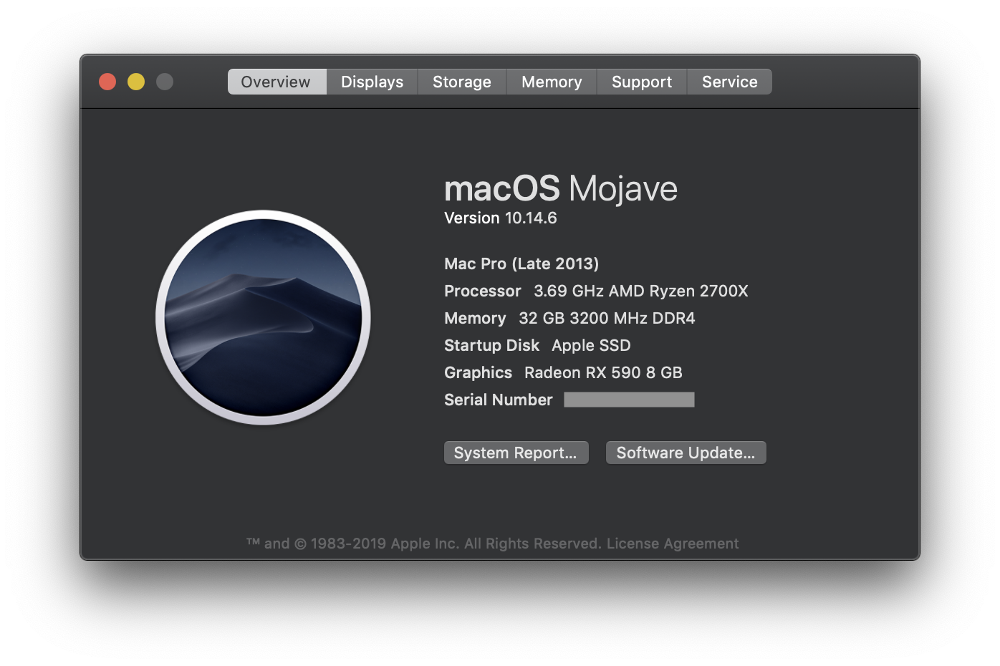

# Clover EFI for Ryzen 2700X &amp; ASRock Fatal1ty X470 Gaming-ITX/ac &amp; DW1820A

## Hardware Builds

| Type                 | Name                               |
| -------------------- | ---------------------------------- |
| CPU                  | Ryzen 2700X                        |
| Mother Board         | ASRock Fatal1ty X470 Gaming-ITX/ac |
| Audio                | ALC1220                            |
| GPU                  | Sapphire Radeon RX 590 8 GB        |
| RAM                  | 32G DDR4 (16G \* 2)                |
| Wireless & Bluetooth | DW1820A                            |

## OS Version

- macOS: 10.14.6 (builds 18G95, 18G103)
- Dual-booting Windows 10

## Functional

- [x] CPU by [AMD-Vanilla](https://github.com/AMD-OSX/AMD_Vanilla)
- [x] USB by [XLNC's script](https://github.com/XLNCs/ryzenusbfix)
- [x] Audio by [AppleALC](https://github.com/acidanthera/AppleALC) (alcid=11)
- [x] Graphics by [WhateverGreen](https://github.com/acidanthera/WhateverGreen)
- [x] WIFI by [AirportBrcmFixup](https://github.com/acidanthera/AirportBrcmFixup) (brcmfx-country=#a)
- [x] Bluetooth by [BrcmPatchRAM](https://github.com/RehabMan/OS-X-BrcmPatchRAM) and [nickhx from osxlatitude](https://osxlatitude.com/forums/topic/11540-dw1820a-the-general-troubleshooting-thread/page/10/)
- [x] iMessage / FaceTime / Airdrop / Handoff

## Issues

- No 32-bit support
- Can't run andriod emulator since android emulator only supports vt-x, but genymotion and virtualbox with amd-v support work well
